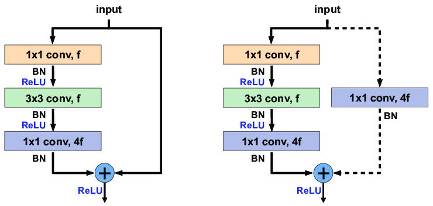

# CNN
- Convolutional layer  
입력 데이터에 필터를 적용하여 특징 맵(feature map)을 생성

- Pooling layer  
특징 맵을 축소하여 계산량을 줄이고 과적합을 방지

- Fully connected layer   
    - 출력 데이터를 생성하고 분류를 수행
    - <U>dense layer(fully connected layer)를 없애거나 최소화하는 추세이다</U>
    - 이유는 파라미터의 숫자 때문인데, fully connected layer의 파라미터가
conv 레이어의 파라미터 수 보다 압도적으로 높기 때문이다
    - 파라미터의 수가 많아지면 gerneralization performence가 낮아지기 때문에 안 좋다.

### 파라미터 수를 줄이며 layer를 깊게 쌓기 위한 방법
#### 1x1 convolution
왜 쓸까?
- 채널을 줄일 수 있기 때문에 파라미터의 수가 줄어들게 되는 효과가 있다.  

#

# CNN의 다양한 모델

### AlexNet  
- 네트워크를 두개로 나눠서 GPU의 한정된 자원을 이용하기 위한 구조로 고안됨  

- 네트워크의 구조는 5개의 convolution layer와 3개의 dense layer로 총 8개의 layer로 구성됨
- 11X11의 filter를 이용함 
    - 뒤에서 나오는 네트워크에 비하면 비효율적임(파라미터의 수가 많아지기 때문)

#### AlexNet이 효과적인 이유  
지금은 당연하지만, 발표될 당시에는 획기적인 생각들  
- ReLU activation function을 이용 
    - vanishing problem 극복
    - vanishing problem이란 신경망의 깊이가 깊어질수록, 혹은 특정 가중치 값이 너무 작아질 때, 그래디언트가 소실되는 현상
- 2개의 GPU를 사용
- data augmentation 사용
- dropout 사용

### VGGNet

- 3X3 convolution filter만 사용했다는 특징이 있다.
- 1X1 filter를 fully connected layer에 사용했지만, 여기에서는 파라미터의 숫자를 줄이기 위한 목적은 아님

#### 3X3 filter를 쓰는 것이 좋은 아이디어인 이유
3X3을 두번 이용했을 때와 5X5를 한번 이용했을 때를 비교해보면 
출력의 shape은 동일하나 파라미터의 수가 적은 것을 알 수 있다.

### GoogLeNet

- 1X1 convolution layer를 통해 채널 개수를 줄이는 효과가 있음
- 이를 통해 파라미터의 개수를 줄이는 특징이 있다.

- 여러개의 네트워크가 반복되는 구조(Network In Network)

### inception block

- 하나의 입력이 여러개로 퍼졌다가 하나로 합쳐지는 구조
- 5X5와 3X3 filter의 연산을 하기 전에 1X1 filter로 먼저 연산한다.
- inception block이점은 따라서 파라미터 수를 줄이는 것이다.(1X1 filter 적용)

### ResNet
#### skip-connection
- ResNet은 residual block이라는 구조를 갖는다.

- x가 layer를 지나고 난 결과 f(x)에 다시 x를 더해주기 때문에 skip connection이라고 부른다.

- 2가지의 shortcut 방식이 있는데, 첫번재와 같이 simple shortcut이 있는 반면 두번째와 같이 projection shortcht이 있다.
- projection shortcut은 1x1 convolution layer를 추가하여 채널의 수를 조정하는 효과가 있다.

#### Bottleneck architecture

- 기존의 3X3 filter가 2개 있는 구조에서 1X1 filter 사이에 3X3 filter가 끼여있는 형식을 이용
- layer를 깊게 쌓으면서 activation function이 증가하여 non-linearity가 증가함과 동시에 파라미터 수를 줄이는 효과가 있다.

### DenseNet  
  

#### concatenation  

- ResNet은 x를 더해주는 방식이었다면 DenseNet은 x를 concat하는 방식으로 구현함
- concat하는 방식으로 구현했을 때 채널의 수가 무한하게 많아지는 문제가 생기며 이때 Pooling layer와 1X1 convolution layer를 이용하여 이러한 문제를 해결한다.

# Sementic Segmentation & Detection

### Sementic Segmentation
- 이미지의 픽셀마다 분류하는 기법
- 하나의 이미지의 각 픽셀에 따라 물체를 구별
- 자율주행 자동차 문제에 활용되기도 함

#### Fully Convolutional network
- Sementic Segmentation을 위해서 사용되는 기법
- 기존 CNN은 dense layer를 통과하기 전에 convolution 된 이미지를 fully conneted layer를 통과해주는 과정을 거친다
- 하지만 Fully Convolutional network를 가진 CNN은 dense layer 없이 fully conneted layer을 통해 output shape을 만들어 주는 것을 같게 한다
- <U>결국 기존 dense layer와 Fully Convolutional network의 파라미터 개수의 차이는 존재하지 않는다</U>
- 왜 쓸까?
    - 결론부터 말하자면 픽셀의 정보를 유지하기 위해서이다.
      
    - 첫번째 구조는 fully connected layer가 구성되어 있는 구조이다.  
        - 픽셀의 위치에 대한 정보는 나타나지 않고 각 class별 확률을 output으로 나타내고 있다.
    - 두번째 구조는 fully convolutional network가 구성되어 있는 구조이다.  
        - 픽셀의 정보가 히트맵 형태로 보여지는 것을 확인할 수 있고 고양이에 대한 위치 정보를 포함하고 있다.
        - <U> 대신 output의 크기가 조금 줄어들었다. </U> 

#### Deconvolution
- Fully Convolutional network를 통해 구해진 output의 size를 키워주기 위한 방법

- 직관적으로 해석하자면 convolution의 역방향 연산이다.
- 하지만 convolution의 역 연산은 불가능하다.(10은 3+7,5+5 등 다양하게 나눠줄 수 있는 것과 같은 논리)
- 하지만 deconvolution연산을 위한 파라미터 세팅 시에 convolution의 파라미터 개수와 같음

### Detection
- segmentation과 비슷하지만 bounding box를 통해 물체의 위치를 나타내는 것을 의미한다.

#### R-CNN
- 하나의 이미지 안에서 2000가지 정도의 지엽적 이미지를 추출해서 input layer에 맞게 reshape 후 linear svm을 통해 분류하는 방법
- 하나의 이미지마다 2000번의 모델학습이 필요하기 때문에 굉장히 비효율적임

#### SPPNet
- 하나의 이미지 데이터에 대해 한번의 모델학습만 진행하여 feature map을 추출하고 detection하고자 하는 부분만 뽑아서 bounding box로 나타내는 기법  
- R-CNN은 2000번의 모델학습이 필요하지만 SPPNet은 한번의 모델학습으로 사용이 가능
- 결국에는 필요한 bounding box 만큼 추출해서 분류하는 작업이 여러번 반복되긴 함  

#### Fast R-CNN
- 기본적인 개념은 SPP와 동일하지만, Roi feature vector를 통해서 bounding box를 분류했다는 차이가 있다.

#### Faster R-CNN
- Region Proposal Network + Fast R-CNN
- 기존의 Fast R-CNN에서 bounding box를 뽑는 것도 network로 학습하자는 개념에서 시작됨

#### Region Proposal Network
- 이미지에서 특정 영역이 bounding box로써 의미가 있는지 없는지를 찾아주는 것

- anchor box : 미리 정해놓은 bounding box의 크기, 따라서 해당 anchor box의 사이즈를 미리 정해놓고 이미지 안의 물체를 탐색한다.

- Region Proposal Network의 anchor box는 9개의 region size를 가지게 된다.    
- 해당 물체가 어떤 것인지 분류하는 것은 뒷단에서 처리  

#### YOLO
- bounding box를 Region Proposal Network처럼 anchor 박스를 미리 지정하지 않고 한번에 처리함
- 내가 찾고자 하는 물체의 중심이 grid cell에 들어가면 bounding box와 해당 물체가 무엇인지 class를 한번에 바로 알려줌
- Faster R-CNN보다 빠름