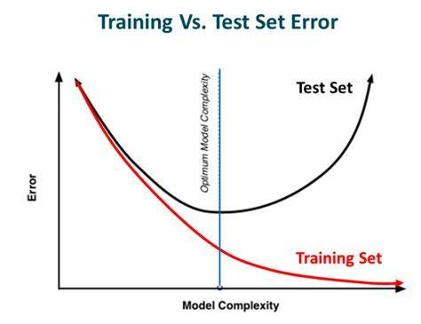
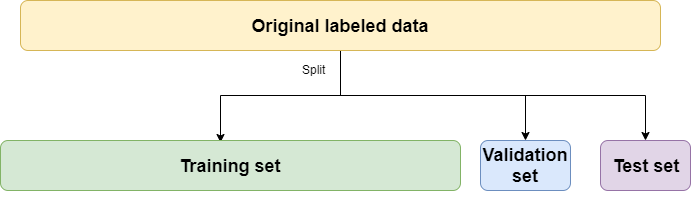
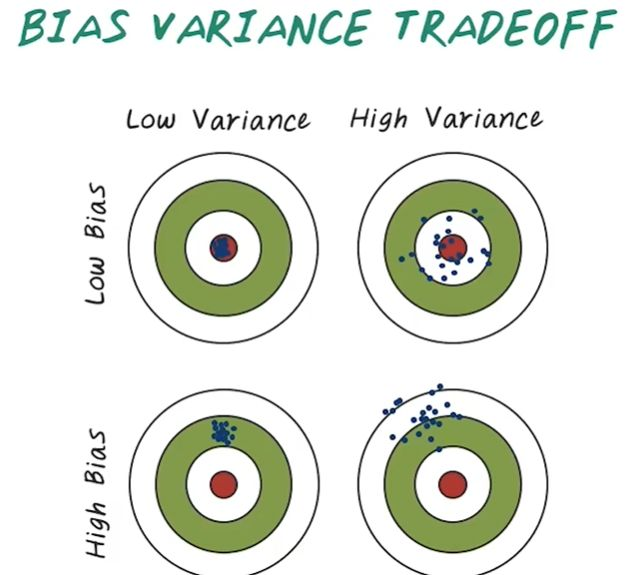
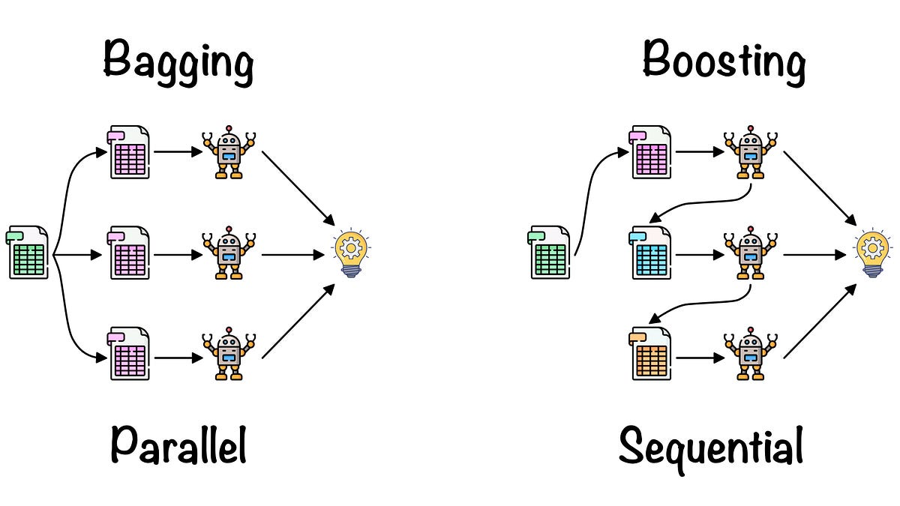
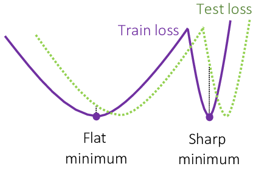
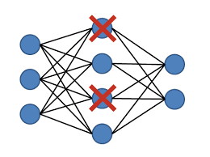

### Gradient Decent
- loss function에서 최소값을 갖는 파라미터를 loss function의 미분을 통해 찾는 방법

### Generalization performance

- Generalization performance는 test error와 train error간의 차이(Generalization gap)를 의미한다  
- 따라서 Generalization gap이 낮으면 Generalization performance가 좋다고 판단  
- 만약에 train의 성능이 안좋은데 Generalization gap이 작다면 Generalization performance는 좋지만 test data의 성능이 좋다고 말할 수 없다.  
       - Generalization performance는 단순히 Generalization gap이 크냐 작냐로만 판단하는 지표이다.

### under-fitting 
- 모델이 너무 단순하여 데이터의 복잡성을 잘 파악하지 못하는 상황
- 훈련 데이터와 테스트 데이터 모두에서 성능이 낮아지는 현상을 일으킬 수 있음
### over-fitting
- 학습데이터에 대해서 잘 작동하지만, 테스트 데이터에 대해서 잘 작동하지 않는 것

### cross validation

- 학습데이터를 k개로 나눠서 그 중 k-1개의 데이터로 학습을 시키고 나머지 1개의 임시 테스트 셋(valiation set)으로
테스트 데이터의 성능을 측정하기 전에 실험해보는 것이다.  
- 하이퍼파라미터를 찾을 때 주로 사용되며 최적의 하이퍼파라미터를 찾은 후 최종적으로 k개의 데이터 전체로
모델 학습을 시킨 후 test 데이터에 대한 성능평가를 진행한다.
- 어떠한 경우에도 모델을 학습시킬 때 test 데이터에 대한 포함은 되어선 안된다.

### bias-variance tradeoff

- variance는 어떠한 입력을 넣었을 때 출력이 얼마나 일정한지를 나타내는 것이다.  
- bias는 실제 target에 근접하게 접근하는지에 대해 나타내는 것이다  
- bias-variance tradeoff는 노이즈가 껴있는 데이터에 variance와 bias를 조정하며 실제 데이터에 대해
예측을 할 수 있는데, variance와 bias를 둘 다 줄이긴 힘들고 두 변수간의 균형점을 찾는 과정을 의미한다.

### bootstrapping
- 학습데이터 중 일부를 랜덤하게 뽑아서 여러 개의 모델을 만들고 성능을 비교하는 방법

### bagging
- bootstrapping의 한 방법으로 학습 데이터 중 일부를 랜덤하게 뽑아서 여러개의 모델을 만들고
다양한 모델들의 성능을 평균해서 나타내는 방법  
- 일반적으로 이런 기법을 앙상블 기법이라고도 한다.
<U>Parrallel처리 방식</U>  

### boosting
- 학습 데이터 일부를 뽑아서 모델을 만들고 나머지 데이터에 대해서 새로운 모델을 학습시켜서
여러개의 week learner모델들을 하나의 strong learner 모델로 연결 시키는 방법  
<U>sequential 처리 방식</U>

### Gradient Descent
1. SGD  
데이터 1개씩 뽑아서 gd를 진행하는 것
2. Minibatch Gradient Descent
데이터의 일부만 랜덤하게 뽑아서 gradient descent를 진행하는 것
3. Batch Gradient Descent
데이터 전부를 한번에 gradient descent를 진행하는 것

- 일반적으로 minibatch gd를 이용
#### Batch size
- 배치 사이즈를 크게하는 것 보다 작게 하는 것이 일반적으로 좋다
아래와 같은 사진을 보면 알 수 있다.

- batch size를 작게 하면 flat minimum이 생기는데 이 경우 generalize performence가 높은 것을 알 수 있다.
- batch size가 크면 sharp minimum이 생기는데 이 경우 generalize performence가 낮은 것을 알 수 있다.

## Gradient Descent Method
#### Momentum
- 경사하강의 방향성이 다음 계산에서도 이어질 수 있다는 것에 착안해서 만들어진 방법
- Beta라고 불리는 하이퍼파라미터를 이용해서 이전의 gradient정보(모멘텀)과 현재 gradient를 합친
값을 gradient descent에 이용하게 된다. 
#### Nesterov Accelerate Gradient
- Momentum이 수렴하지 않고 로컬 미니멈 주위를 계속 맴도는 단점이 있는데 이것을 보완하기 위한 방법

#### Adagrad
- 파라미터 별로 변화율이 높은 파라미터들에 대해 가중치를 부여해서 학습에 적용시키는 방법
- 단점 - 수식에서 나온 가중치인 G의 값이 학습을 진행하면서 계속 커지기 때문에 나중에는 학습이 안된다는 단점이 있다.

#### Adadelta
- G의 값을 최대한 줄이기 위해서 고안된 방법
- 이전 시점 전체가 아닌 특정 window size를 설정하고 해당 timestamp안의 정보만 G에 저장
- 단점 - GPT와 같은 큰 모델에는 파라미터의 기본적인 개수가 많기 때문에 소용이 없음  
       - Learning rate이 없기 때문에 실제로 많이 사용하지는 않는다.

#### RMSprop
- Adadelta에서 학습률을 추가한 모델

#### Adam
- adaptive gradient decent와 momentum의 개념을 합친 방법

## regularization

#### early stopping
- validation과 train set의 성능의 비교를 통해 학습 차이가 가장 적게 나는 지점에서 학습을 멈추는 방법

#### parameter norm penalty
- 파라미터가 너무 크지 않게 보정해주는 방법

#### data augmentation
- 데이터가 부족할 때 기존 데이터들을 변형하여 새로운 데이터셋을 만들어 내는 방법

#### noise robustness
- 입력과 weight에 의도적으로 noise를 추가하게 되면 학습 성능이 올라가는 실험적인 결과를 통해 고안해낸 방법

#### label smoothing
- 일반적으로, 정확한 라벨을 1로 고려하는 것이 아니라, 다른 클래스들에 대한 확률을 낮추고 모든 클래스에 일정한 확률을 부여하여 모델의 일반화 능력을 향상시킨다.

#### Dropout

- 신경망의 과적합을 줄이기 위한 정규화(regularization) 기법 중 하나로, 훈련 과정에서 무작위로 선택된 일부 뉴런을 제거하거나 비활성화시키는 것을 말함
- 네트워크가 특정 뉴런에 지나치게 의존하는 것을 방지하여 일반화 능력을 향상
- 예를 들어, dropout을 0.5로 설정하면 해당 레이어의 뉴런 중 50%를 랜덤하게 비활성화시킨다.

#### Batch normalization
- 학습을 안정화하고 속도를 높이기 위한 기법 중 하나
- 각 미니배치(mini-batch)의 입력 데이터를 평균과 분산으로 정규화(normalization)