## Sequential data
- 순서에 따라 의미를 가지는 데이터를 뜻한다.
- 텍스트나 시계열 데이터, 음성신호 등이 있다.

#### Sequential data를  처리하는 데 있어서 어려움 
- Sequential data의 길이가 길고 땨라서 차원을 어디까지 나누어야할지 모르겠는 어려움이 있다.

### 가장 간단한 Sequential model
- 대표적으로 naive sequential model이 있다.
   - t시점의 output에 대해서 t-1부터 이전 시점의 데이터를 고려하는 모델
- 입력(이전데이터)이 들어왔을 때 다음 입력(다음 데이터)을 예측하는 것(예를 들어 language model)
- sequence의 길이가 길어지면 연산이 많아진다는 단점이 있다.

### Autoregressive model
- 이전 데이터의 term을 특정 구간으로 fix하고 예측을 함, 따라서 성능이 더욱 빨라지게 되는 효과가 있다.  
- generative model에서 많이 활용됨

### Markov model(first order autoregressive model)
- 현재는 바로 직전 시점에 대해서만 dependence한 특징이 있음을 가정한 모델
- 과거의 많은 정보들을 잃게 됨
- 현실에서는 말이 안되는 모델

### latent autoregressive model
- 과거의 많은 정보를 고려해야하지만 그러지 못하는 상황에서
과거의 정보를 요약하고 있는 hidden state를 추가함  
- 이때 다음 시퀀스에서 활용하는 이전 데이터는 직전 시퀀스의 hidden state데이터만 참조한다

### RNN(vanila RNN)
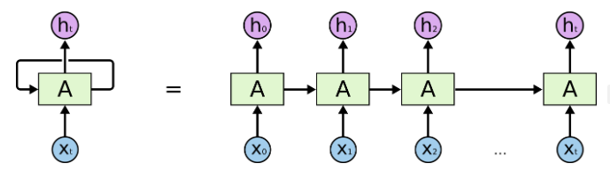  
- 단점 
    - short term dependency는 잘 잡지만 long term dependency는 잘 못잡음
    - vanishing / exploding gradient 문제
    
### LSTM
- RNN의 문제점인 long term depend를 잘 잡기 위해 고안됨
- 게이트가 너무 많아서 파라미터가 많은 문제점이 있다.

(https://www.turing.com/kb/comprehensive-guide-to-lstm-rnn)  
뉴럴 네트워크의 한 종류로, 순환 신경망(Recurrent Neural Networks, RNN)의 한 변종인 LSTM(Long Short-Term Memory)은 시계열 데이터나 자연어 처리와 같은 시간적/순차적인 데이터에서 장기 의존성(Long-Term Dependencies)을 학습하는 데 특히 유용한 모델입니다. LSTM은 RNN의 기본 아이디어를 확장하여 장기 의존성을 효과적으로 학습하고, 그래디언트 소실 또는 폭주 문제를 완화하여 긴 시퀀스에 대한 효과적인 학습을 가능하게 합니다.

### LSTM의 핵심 구성 요소 
1. **셀 상태(Cell State)**:    
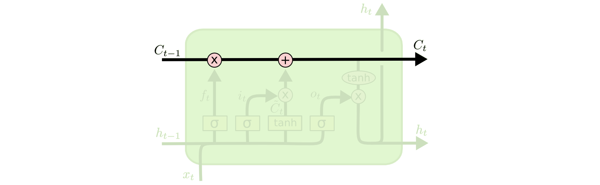  
   - LSTM은 정보를 저장하는데 사용되는 중요한 구성 요소인 셀 상태를 보유하고 있습니다. 이 셀 상태는 정보를 추가하거나 제거하기 위해 게이트로 조절됩니다.

2. **게이트(Gates)**:
   - LSTM은 게이트 메커니즘을 사용하여 정보의 흐름을 제어합니다.  
   - **Forget Gate**: 이전 셀 상태로부터 어떤 정보를 버릴지 결정합니다. (기존의 정보를 얼마나 반영할 지)  
   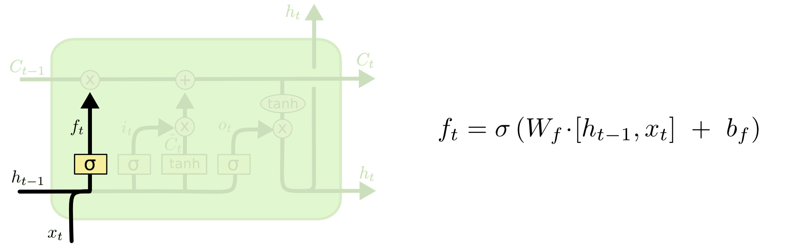  
   - **Input Gate**: 현재 입력에서 어떤 정보를 저장할지 결정합니다.(새로운 정보를 얼마나 반영할 지)    
   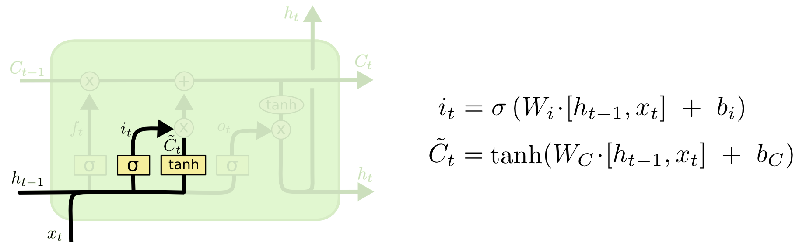  
   - **Output Gate**: 셀 상태로부터 어떤 값을 출력할지 결정합니다. (업데이트 된 셀 상태를 얼마나 반영할 지)   
   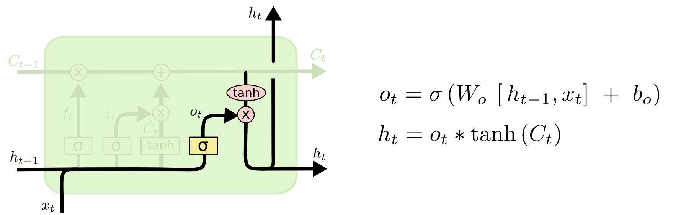  

3. **셀 상태 업데이트 및 출력 계산**:
   - 게이트의 결정에 따라 셀 상태가 업데이트되며, 이 셀 상태에서 출력값이 계산됩니다.  
    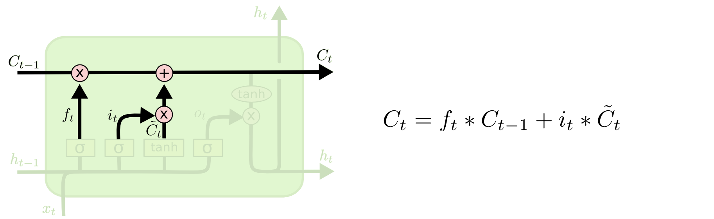  
### LSTM의 동작 방식

1. **Forget Gate 동작**:
   - 입력: 이전 은닉 상태($h_{t-1}$)와 현재 입력($x_t$)
   - 이전 은닉 상태와 현재 입력을 받아서 어떤 정보를 버릴지 결정합니다.
   - 시그모이드 함수를 통해 이전 정보 중에서 보존할 정보를 0에서 1 사이의 값으로 결정합니다.  
   - **Forget Gate의 output값은 $C{t-1}$과 곱해져서 결국 이전 셀 상태의 값들을 얼마나 반영할 지에 대한 가중치를 결정해주게 된다.**
    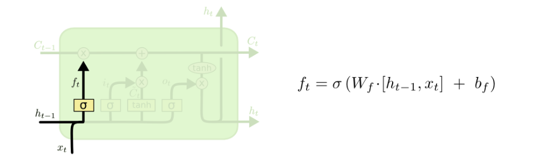

2. **Input Gate 및 셀 상태 업데이트**:
   - 입력: 이전 셀 상태($h_{t-1}$)와 현재 입력($x_t$)  
   - 현재 입력과 이전 은닉 상태를 기반으로 어떤 새로운 정보를 저장할지 결정합니다.  
   - 두 개의 단계를 거쳐 정보를 업데이트합니다. 
       - 먼저 시그모이드 게이트를 사용하여 어떤 값을 업데이트할 지 결정합니다.  
       - 다음으로 tanh 함수를 통해 새로운 후보 값(candidate values)을 생성합니다.  
       - 시그모이드 게이트의 출력과 tanh의 출력을 곱하고, 이를 이전 셀 상태에 더하여 새로운 셀 상태를 얻습니다.  
       - **Input Gate의 output 값은 새롭게 셀 상태에 추가될 입력 $\~{C}_{t}$와 얼마나 반영할지에 대한 가중치 $i_{t}$ 에 대한 곱이다.**
       - **그래서 최종적인 셀 상태는 이전 셀 상태를 얼마나 반영할지 와 새로운 셀 상태를 얼마나 반영할지에 대한 정보를 더한 값이다.**  
       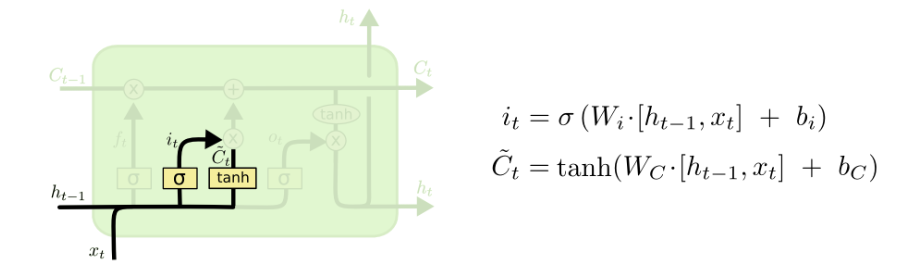 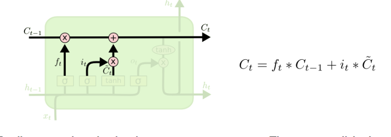

3. **Output Gate 및 출력 계산**:
   - 출력을 생성하기 위해 현재 입력과 셀 상태를 기반으로 어떤 값을 출력할지 결정합니다.  
   - 현재 셀 상태를 tanh에 통과시켜 값을 조정하고, 이를 시그모이드 게이트의 출력과 곱하여 최종 출력값을 생성합니다.  
    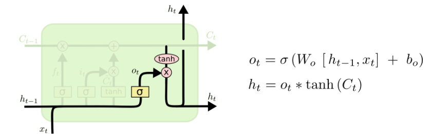

### LSTM의 장점

1. **장기 의존성(Long-Term Dependencies) 처리**:
   - RNN의 단점인 장기 의존성 문제를 완화하여 더 긴 시퀀스에서 정보를 보존하고 활용할 수 있습니다.

2. **그래디언트 소실 문제 완화**:
   - LSTM은 게이트 메커니즘을 통해 그래디언트 소실 문제를 줄이고 효과적으로 학습할 수 있도록 도와줍니다.

3. **다양한 응용 분야**:
   - 자연어 처리, 음성 인식, 주가 예측 등 다양한 분야에서 시계열 데이터의 효율적인 처리를 가능하게 합니다.

LSTM은 시퀀스 데이터의 모델링과 예측을 위한 강력한 도구로, 그 유연성과 성능으로 많은 분야에서 널리 사용되고 있습니다.

### GRU
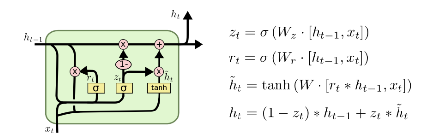
- 셀 상태와 은닉 상태로 나누지 않고, 은닉 상태 하나로 합침
   - **Update Gate**
       - 새로운 input과 이전 시점의 은닉 상태에 가중치를 곱하고 시그모이드 함수를 통과시켜 업데이트할 비중을 정함  

   - **Reset Gate**  
       - Update Gate와 동일한 값에 대해 시그모이드를 통과시켜 비중을 정하고 기존의 은닉 상태인 ${h}_{t-1}$에 가중치를 곱하는 방식으로 $\~{h}_{t}$을 구한다.
   - 최종적으로 기존 은닉 상태와 새로운 은닉 상태의 각각에 가중치를 곱하여 각각 얼마나 반영하여 새로운 은닉 상태를 만들어 낼 것인지 정한다. 
   
- LSTM의 문제점인 게이트 개수가 많음을 보완
- 파라미터를 줄이면서 generalize performence를 향상시킴

 
하지만 요즘 RNN LSTM GRU보다 transformer를 많이 사용한다.   
reference: (https://colah.github.io/posts/2015-08-Understanding-LSTMs/)  
