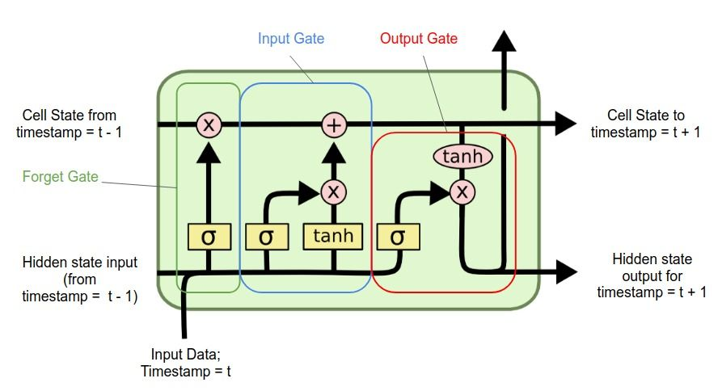

## Sequential data
- 순서에 따라 의미를 가지는 데이터를 뜻한다.
- 텍스트나 시계열 데이터, 음성신호 등이 있다.

#### Sequential data를  처리하는 데 있어서 어려움 
- Sequential data의 길이가 길고 땨라서 차원을 어디까지 나누어야할지 모르겠는 어려움이 있다.

### 가장 간단한 Sequential model
- 입력(이전데이터)이 들어왔을 때 다음 입력(다음 데이터)을 예측하는 것(예를 들어 language model)

### Autoregressive model
- 이전 데이터의 term을 특정 구간으로 fix하고 예측을 함, 따라서 성능이 더욱 빨라지게 되는 효과가 있다.  
- generative model에서 많이 활용됨

### Markov model(first order autoregressive model)
- 현재는 바로 직전 시점에 대해서만 dependence한 특징이 있음을 가정한 모델
- 과거의 많은 정보들을 잃게 됨
- 현실에서는 말이 안되는 모델

### latent autoregressive model
- 과거의 많은 정보를 고려해야하지만 그러지 못하는 상황에서
과거의 정보를 요약하고 있는 hidden state를 추가함  
- 이때 다음 시퀀스에서 활용하는 이전 데이터는 직전 시퀀스의 hidden state데이터만 참조한다

### RNN(vanila RNN)
- 단점 
    - short term dependency는 잘 잡지만 long term dependency는 잘 못잡음
    - vanishing / exploding gradient 문제
    
### LSTM
- RNN의 문제점인 long term depend를 잘 잡기 위해 고안됨

- 하나의 cell에 3개의 input이 들어가는 것을 확인할 수 있다.
    - input data
    - cell state
    - hidden state
    
- 게이트가 너무 많아서 파라미터가 많은 문제점이 있다.

### GRU
- LSTM의 문제점인 게이트 개수가 많음을 보완
- 파라미터를 줄이면서 generalize performence를 향상시킴

 
하지만 요즘 RNN LSTM GRU보다 transformer를 많이 사용한다.

