## Seq2Seq 모델

Seq2Seq(Sequence-to-Sequence) 모델은 번역, 챗봇 등에서 사용되는 인코더-디코더(Encoder-Decoder) 구조의 신경망입니다. 이 모델은 시퀀스 입력을 다른 시퀀스로 변환하는 데 사용됩니다.

- **동작 방식**:
    1. **인코더(Encoder)**: 입력 시퀀스를 고정된 크기의 벡터 형태로 압축합니다.
    2. **디코더(Decoder)**: 인코더에서 생성된 벡터를 기반으로 출력 시퀀스를 생성합니다.

Seq2Seq는 RNN(Recurrent Neural Network)을 기반으로 하며, 특히 LSTM이나 GRU(Gated Recurrent Unit)와 같은 순환 신경망을 사용하여 장기 의존성을 학습합니다. 하지만, 장기 의존성 처리나 병렬화 측면에서 한계가 있었습니다.

----
----

## Attention
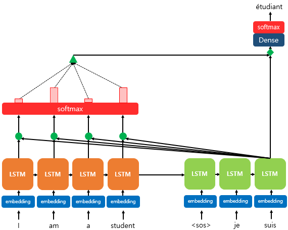  
어텐션 메커니즘(Attention Mechanism)은 주로 시퀀스 데이터를 처리하는 인공 신경망에서 사용되는 기술 중 하나입니다. 특히 자연어 처리나 이미지 처리와 같은 분야에서 활발하게 활용되며, 모델이 입력 데이터의 특정 부분에 집중하고 그 중요성을 학습할 수 있도록 돕습니다.

### 어텐션 메커니즘의 구조:
- **다양한 어텐션 구조 중 Dot-Product Attention의 작동 방식에 대한 설명**

### Dot-Product Attention 동작 방식:

1. **Query, Key, Value (질의, 키, 값)**:
   - 각 단어나 위치에 대한 Query, Key, Value 벡터를 생성합니다. 이 벡터들은 모델의 각각의 어텐션 계산 단계에 사용됩니다.

2. **스코어 계산**:
   - Query와 Key 간의 유사도를 계산합니다. 이를 위해 Dot Product를 사용하여 Query와 Key 간의 내적을 계산합니다.
   - 내적(dot product)은 두 벡터 사이의 유사도를 계산하는데 사용되며, 두 벡터가 얼마나 비슷한 방향을 가지고 있는지를 나타냅니다.  
   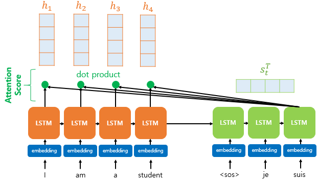
   - 각 시점($1,2,...,N$)에서 인코더의 은닉 상태 $h1,h2,...,h_{N}$ 
   - 현재 시점 $t$에서 디코더의 은닉상태 $S_{t}$
   - 각 은닉 상태의 차원이 같다고 가정
   - 이 때 어텐션 스코어는 다음과 같이 구할 수 있다.  
   $score(s_{t},\ h_{i}) = s_{t}^Th_{i}$
   - 따라서 디코더의 $t$시점과 인코더의 각 시점에서의 어텐션 스코어는 다음과 같이 나타낼 수 있다.  
   $e^{t}=[s_{t}^Th_{1},...,s_{t}^Th_{N}]$

3. **스코어 정규화**:
    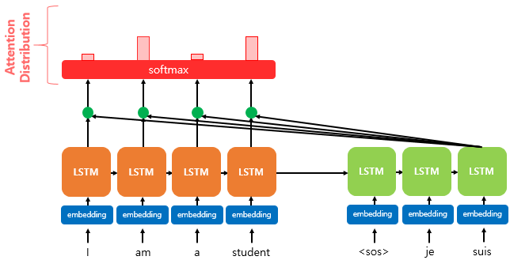
   - 내적 값을 스케일링하고, 소프트맥스(softmax) 함수를 적용하여 어텐션 가중치를 얻습니다.
   - 내적 값이 클 수록 (두 벡터가 유사할수록) 해당 위치의 중요도가 높아지도록 스케일링됩니다.
   - 디코더의 $t$ 시점에서의 어텐션 분포 $α^{t}$는 아래와 같이 나타낼 수 있다.  
        $α^{t} = softmax(e^{t})$

4. **Attention value 구하기**:
    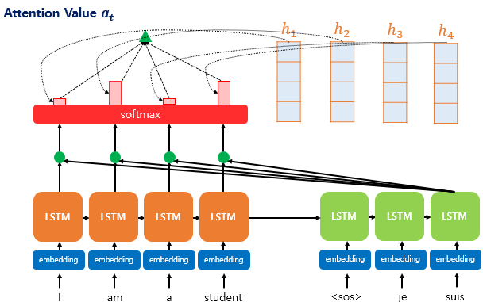
   - 어텐션 가중치와 각 인코더의 은닉상태를 곱하여 각 값에 대한 가중합을 계산합니다.  
        $a_{t}=\sum_{i=1}^{N} α_{i}^{t}h_{i}$
   - 이 가중합을 최종 Attention value로 사용하게 됩니다.

5. **Attention value와 $t$시점의 은닉 상태 concatenate**
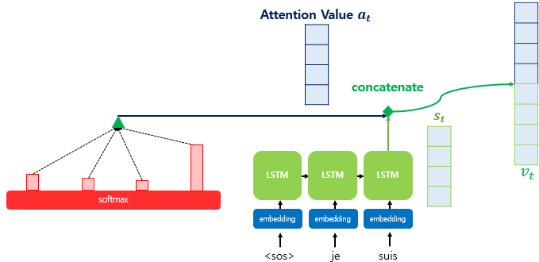
   -  디코더의 현재 시점 $t$에서의 출력이자 $t+1$시점의 입력이 될 $v_{t}$는 $a_{t}$와 $s_{t}$를 concat한 값이다.
   -  엄밀히 말하면 $v_{t}$ 뒤에 dense layer를 거쳐서 $\tilde{{s}}_{t}$가 되어야 하지만 이 부분은 생략했음
### Dot-Product Attention의 특징:

- **계산 효율성**:
  - 내적 연산은 행렬 곱셈(Matrix Multiplication)의 형태로 효율적으로 계산될 수 있어, 병렬 처리에 유리합니다.
  
- **유사도 강조**:
  - 내적 연산은 두 벡터 간의 방향성이 얼마나 유사한지를 나타내므로, 유사도가 높을수록 두 벡터의 정보를 강조하는 경향이 있습니다.

Dot-Product Attention은 내적을 통해 두 벡터 사이의 유사도를 계산하고, 이를 활용하여 어텐션 가중치를 결정하는 방식으로 동작합니다. 트랜스포머와 같은 모델에서 어텐션 메커니즘의 핵심적인 부분 중 하나로 사용되며, 어텐션 스코어 계산을 효과적으로 처리하여 모델이 특정 부분에 집중하게 합니다.

----
----
## Transformer 모델
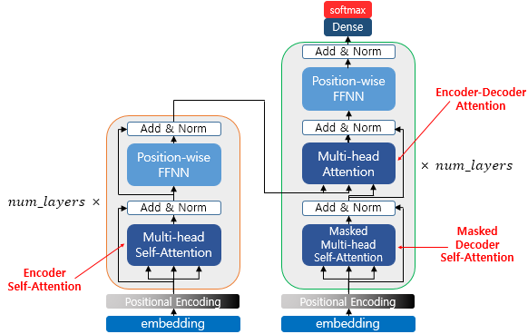
Transformer는 Seq2Seq 모델의 한계를 극복하기 위해 등장한 모델로, RNN 대신 어텐션(Attention) 메커니즘을 기반으로 합니다. Transformer는 인코더와 디코더로 구성되며, 이때 인코더와 디코더는 RNN을 사용하지 않습니다. 번역 및 자연어 처리와 같은 작업에서 뛰어난 성능을 보입니다.

- **원리**:
    - **어텐션 메커니즘**: 입력 시퀀스 내의 각 단어가 출력 시퀀스에 어떻게 영향을 주는지를 계산합니다.
    - **셀프 어텐션(Self-Attention)**:   
    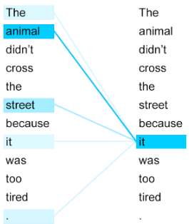  
    입력의 모든 단어 간 상호 작용을 고려하여 특정 단어를 인코딩합니다.
    - **인코더-디코더 구조**: 인코더에서 입력 시퀀스를 처리하고, 디코더에서 출력 시퀀스를 생성합니다.
    - **멀티헤드 어텐션(Multi-head Attention)**: 어텐션을 여러 개의 다른 표현 공간에서 병렬로 수행하여 모델의 표현력을 향상시킵니다.
    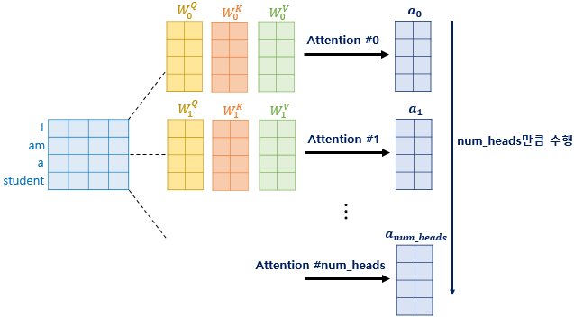
    -  **포지셔널 인코딩 (Positional Encoding)**: 
    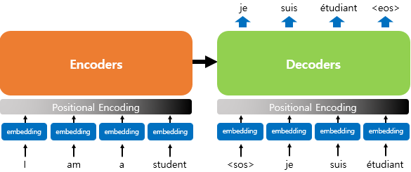  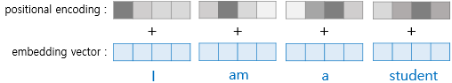  
    단어의 상대적 위치 정보를 모델에 전달하기 위해 사용됩니다. 일반적으로 사인 함수와 코사인 함수를 사용하여 위치 정보를 임베딩합니다. 이때 임베딩 벡터를 임베딩 행렬로 합쳐서 아래와 같이 나타낼 수 있습니다.
    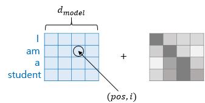
    - 임베딩 벡터와 포지셔널 인코딩 값은 행렬의 덧셈 연산으로 처리한다.

- **주요 하이퍼파라미터**:
1. **임베딩 차원 (Embedding Dimension)**:
   - 모델 내부의 단어 및 위치 정보를 나타내는 벡터의 차원을 결정합니다.

2. **어텐션 헤드 수 (Number of Attention Heads)**:
   - 멀티헤드 어텐션에서 사용되는 어텐션 헤드의 개수를 결정합니다.

3. **인코더 및 디코더 층 수 (Number of Encoder/Decoder Layers)**:
   - 인코더 및 디코더 내의 트랜스포머 블록(층)의 개수를 결정합니다.

4. **배치 크기 (Batch Size)**:
   - 한 번에 모델이 학습하는 데이터 샘플의 수를 결정합니다.

5. **학습률 (Learning Rate)**:
   - 최적화 알고리즘에서 가중치 업데이트에 사용되는 학습 속도를 결정합니다.

6. **드롭아웃 비율 (Dropout Rate)**:
   - 과적합을 방지하기 위해 랜덤하게 뉴런을 비활성화하는 비율을 결정합니다.

#### Self-Attention
- Self-attention은 하나의 시퀀스 내의 요소들 간의 상호 작용을 파악하고 모델링하는 데 사용되며, 일반적인 어텐션은 두 개의 다른 시퀀스 간의 관계를 모델링하고 정보를 전달하는 데에 사용됩니다.
- 본질적으로 Query, Key, Value가 동일한 경우를 말합니다. 
- 이때 Query와 Key의 dimension은 같아야하고 Value의 dimension과는 같을 필요는 없다.
  

Transformer 모델은 이러한 구성 요소와 하이퍼파라미터들을 조합하여, 셀프 어텐션과 멀티헤드 어텐션을 중심으로 한 인코더-디코더 구조를 이용하여 효과적인 시퀀스 모델링과 문장 생성을 수행합니다. Hyperparameter들은 모델의 성능과 학습 속도에 매우 중요한 역할을 합니다.  

#
#
#

reference: 딥러닝을 이용한 자연어 처리 입문(https://wikidocs.net/book/2155)